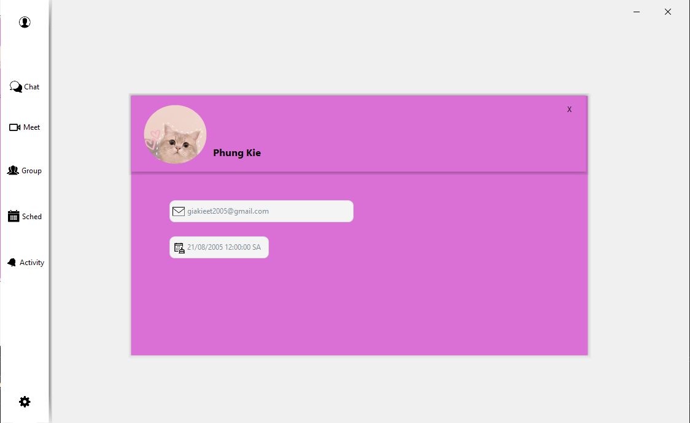

# 📚 CourseManager - Ứng dụng quản lý khóa học trực tuyến  
  

**Môn học:** Lập trình mạng căn bản  
**Mã môn học:** NT106.Q14  
**Nhóm:** 13  
**Bài tập:** Exercise2.2

---

## 📝 Giới thiệu
**CourseManager** là ứng dụng hỗ trợ quản lý khóa học, giảng viên, sinh viên và lịch học một cách trực quan.  

- Sinh viên có thể dễ dàng đăng ký môn học, xem thông tin khóa học, thời khóa biểu.  
- Giảng viên có thể quản lý lớp học, cập nhật tài liệu và điểm.  
- Dự án được phát triển dựa trên kiến thức môn học **NT106.Q14 – Lập trình mạng căn bản**.  

---

## 💡 Tính năng chính
- Quản lý danh sách khóa học (thêm / sửa / xóa / tìm kiếm).  
- Quản lý thông tin sinh viên, giảng viên.  
- Quản lý đăng ký môn học.  
- Xem thời khóa biểu và lịch học.  
- Giao diện thân thiện, trực quan.  
- Dữ liệu lưu trữ tập trung (**SQL Server 2022 + SSMS 21**).  

---

## 🛠️ Công cụ hỗ trợ
- **Ngôn ngữ:** C# (.NET Framework)  
- **UI:** WinForms + Guna UI  
- **Database:** SQL Server 2022  
- **Quản lý CSDL:** SQL Server Management Studio (SSMS 21)  
- **Quản lý mã nguồn:** GitHub  

---

## 📸 Demo
> *Sẽ được cập nhật trong tương lai...*  

---

## 👥 Thành viên nhóm
| Họ và tên             | MSSV     | Email                  |
|------------------------|----------|------------------------|
| Phùng Gia Kiệt         | 23520818 | 23520818@gm.uit.edu.vn |
| Nguyễn Phát Đạt        | 23520258 | 23520258@gm.uit.edu.vn |
| Trần Như Cương         | 23520209 | 23520209@gm.uit.edu.vn |
| Nguyễn Đức Bình An     | 24520055 | 24520055@gm.uit.edu.vn |
| Lê Huy Hiếu            | 24520493 | 24520493@gm.uit.edu.vn |

---

## 🔀 Branches
...
---
## 📸 Giao diện ứng dụng

### 🔑 Đăng nhập (Login)

  

### 📝 Đăng ký (Signup)

  

### 📊 Dashboard

  

 
✨ *Made by Group13_NT106.Q14 | NT106 - BT3*
